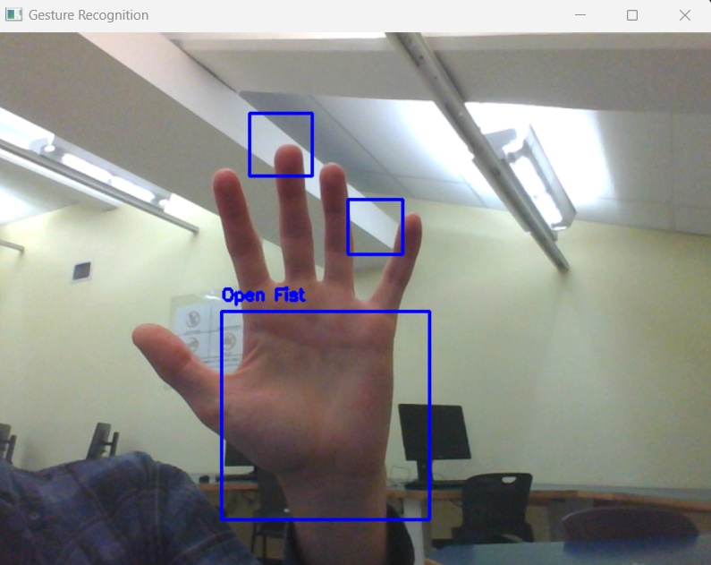

# ExplorationActivity2 - Gesture Recognition Program

## 1. Package/Library Demonstrated
This sample program demonstrates the use of the OpenCV (Open Source Computer Vision) library, a popular computer vision library that provides tools for image and video processing.

## 2. Running the Program
To run the program, follow these steps:
- Ensure you have Python installed on your system.
- Install the required libraries using: `pip install opencv-python`
- Save the script in a file (e.g., `gesture_recognition.py`).
- Download the `haarcascade_hand.xml` file for hand detection. Ensure it's in the same directory as the script.
- Run the script: `python gesture_recognition.py`
- Press 'q' to exit the program.

## 3. Purpose of the Program
This program uses the webcam to capture frames and applies computer vision techniques to detect and recognize hand gestures in real-time. It draws rectangles around detected hands and annotates the image based on the hand's characteristics, such as an open fist.

## 4. Sample Input/Output
- **Sample Input**: Real-time video feed from the webcam.
- **Sample Output**: The program displays the video feed with rectangles drawn around detected hands. It also annotates the image based on the gesture, such as marking an "Open Fist" when a sufficiently large open hand is detected.

